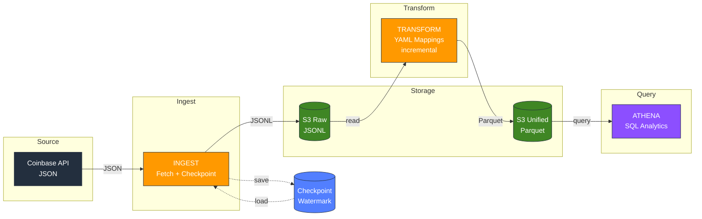
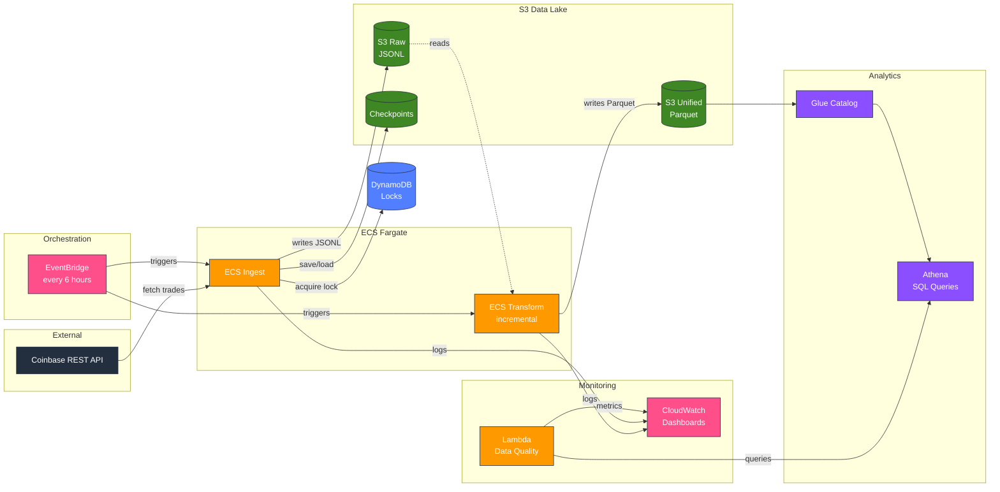
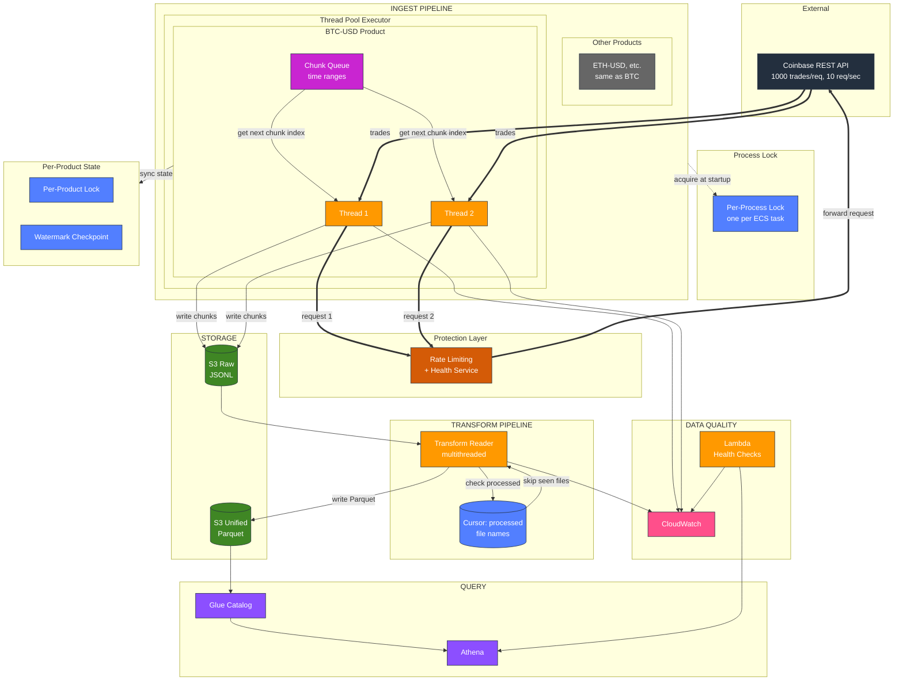
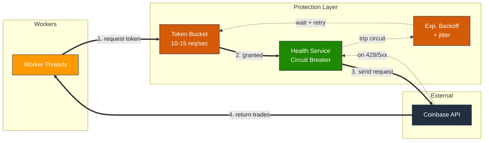
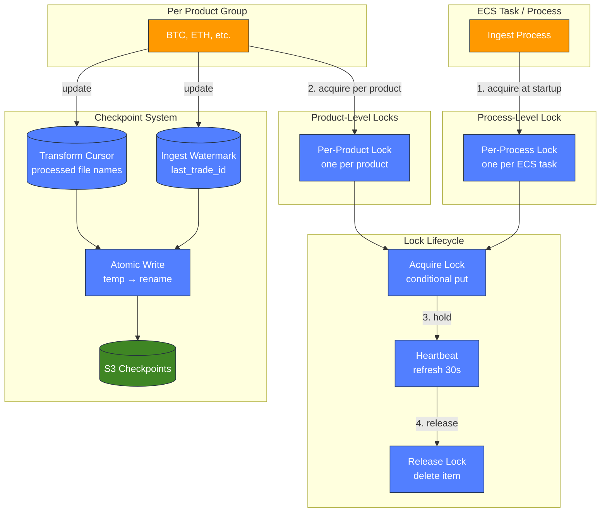

# SchemaHub: Crypto Data Unification

A production-grade mini data platform that normalizes multi-exchange crypto trade data into a single queryable table. See [Correctness Invariants](CORRECTNESS_INVARIANTS.md) for detailed guarantees.

---

## Table of Contents

### 1. Overview
- [Production Dashboard](#production-dashboard)
- [Key Features](#key-features)
- [Architecture at a Glance](#architecture-at-a-glance)

### 2. Getting Started
- [Quickstart](#quickstart)
- [Usage](#usage)
- [Configuration](#configuration)
### 3. Key Technical Details and Design
- [Architecture](#architecture)
- [Correctness & Reliability](#correctness--reliability)
- [Failure Modes & Recovery](#failure-modes--recovery)
- [Storage Layout](#storage-layout)
- [Out of Scope](#out-of-scope)

### 4. Additional Details
- [The Problem](#the-problem)
- [What Success Looks Like](#what-success-looks-like)
- [Deployment](#deployment)
- [Roadmap](#roadmap)
- [License / Credits](#license--credits)

---

## Demo

Live production dashboard running on AWS CloudWatch, updated every 3-6 hours via automated ECS schedules.

### Headline Stats


### Pipeline Operations


### API Health & Reliability


### Data Completeness & Storage


---

## Key Features

- ✅ **Multi-exchange support** — Unified schema across different exchanges (Coinbase, extensible to others)
- ✅ **Warehouse-ready output** — Parquet in S3 optimized for Snowflake COPY INTO ingestion
- ✅ **Multithreaded ingestion** — Parallel product workers + concurrent chunk fetching (configurable up to 200 threads)
- ✅ **Rate limiting & circuit breaker** — Automatic backoff prevents API throttling, graceful degradation
- ✅ **Cloud-deployed & monitored** — Running on AWS with operational dashboards, automated scheduling, and observability
- ✅ **Data quality monitoring** — Automated health checks, freshness alerts, duplicate detection via Lambda
- ✅ **Billions-scale** — Handles billions of trades across products
- ✅ **Zero data loss** — Monotonic watermarks guarantee no gaps or skipped trades
- ✅ **Deduplication ready** — Deterministic keys enable downstream deduplication
- ✅ **Idempotent & resumable** — Safe retries, resume from any failure point
- ✅ **Distributed locking** — DynamoDB-based locks prevent concurrent job conflicts
- ✅ **Cost-effective** — ~$10-15/month on AWS for full operation

---

## Architecture at a Glance



**Data Flow:**
1. **Ingest**: Fetch trades from Coinbase API using watermark checkpoints
2. **Raw Storage**: Immutable JSONL written to S3
3. **Transform**: YAML-based mapping normalizes schemas (incremental)
4. **Unified Storage**: Parquet tables for analytics
5. **Query**: SQL via AWS Athena

See [Architecture](#architecture) for detailed AWS infrastructure and internal component diagrams.

---

# 2. Getting Started

## Quickstart

**Prerequisites:** AWS account, S3 bucket, Docker

```bash
# Ingest trades
docker run YOUR_ECR_IMAGE python3 -m schemahub.cli ingest --s3-bucket BUCKET

# Transform to Parquet
docker run YOUR_ECR_IMAGE python3 -m schemahub.cli transform --s3-bucket BUCKET
```

---

## Usage

```bash
# Setup product list (one-time)
python3 -m schemahub.cli update-seed

# Ingest trades (incremental)
python3 -m schemahub.cli ingest --s3-bucket BUCKET

# Transform to Parquet (incremental)
python3 -m schemahub.cli transform --s3-bucket BUCKET
```

**Flags:** `--dry-run`, `--workers N`, `--chunk-concurrency N`

---

## Configuration

**Environment:** `S3_BUCKET`, `AWS_REGION`, `DYNAMODB_LOCKS_TABLE` (optional)

**S3 structure:**
```
s3://bucket/schemahub/
  ├── raw_coinbase_trades/    # JSONL
  ├── unified_trades/         # Parquet
  └── checkpoints/            # Watermarks
```

---


# 3. Key Technical Details and Design

---

## Architecture

### System Overview

| Layer | Component | Responsibility |
|-------|-----------|----------------|
| **Orchestration** | EventBridge + ECS | Schedule jobs every 6 hours, run containers |
| **Ingestion** | Connectors + ThreadPoolExecutor | Parallel workers, watermark checkpoints |
| **Protection** | Token Bucket + Circuit Breaker + DynamoDB | Rate limiting, backoff, distributed locks |
| **Storage** | S3 (Raw + Unified) | Immutable JSONL → queryable Parquet |
| **Transformation** | YAML Mappings + Transform Engine | Normalize schemas incrementally |
| **Query** | Athena + Glue | SQL analytics over Parquet |
| **Observability** | CloudWatch + Lambda | Logs, metrics, dashboards, data quality |

### AWS Infrastructure



### Detailed Internal Architecture



#### Protection Layer Detail



#### Checkpoint & Locking Detail



---

### Key Design Decisions

- **Watermark-based ingestion** — Incremental, resumable, no duplicates
- **Raw + Unified layers** — Immutable audit trail + flexible reprocessing
- **Deterministic S3 keys** — Idempotent writes; retries overwrite safely
- **Per-product checkpoints** — Parallel backfills without conflicts
- **YAML mappings** — Declarative, easy to extend for new sources
- **ECS over Lambda** — Longer timeouts, more memory for large batches
- **JSONL → Parquet** — Human-readable raw, 10x compressed analytics
- **Static thread pools** — Bottleneck is API rate limit, not local resources
- **Token bucket rate limiting** — Smooth request flow, respect API limits
- **Circuit breaker** — Back off on errors, prevent cascade failures

---

### Technologies

**Core:** Python 3.9+, Pydantic, PyArrow
**AWS:** ECS, EventBridge, S3, CloudWatch, Athena, Glue
**Format:** JSONL (raw), Parquet (unified)

---

### Concurrency & Performance

| Configuration | Threads | Use Case |
|---------------|---------|----------|
| `--workers 3 --chunk-concurrency 5` | 15 | Default |
| `--workers 5 --chunk-concurrency 9` | 45 | Optimal (saturates rate limit) |
| `--workers 10 --chunk-concurrency 20` | 200 | Backfill |

**Rate Limiting:** Token bucket (10-15 req/sec) + circuit breaker on repeated 429s.

See [Performance Guide](docs/PERFORMANCE.md) for Little's Law derivation, benchmarks, and tuning.

---

## Correctness & Reliability

| Guarantee | Mechanism |
|-----------|-----------|
| **Zero data loss** | Monotonic watermark checkpoints |
| **Zero duplicates** | Primary key dedup in unified layer |
| **Idempotent retries** | Deterministic S3 keys |
| **Resumable** | Per-product checkpoints |

See [CORRECTNESS_INVARIANTS.md](CORRECTNESS_INVARIANTS.md) for detailed analysis.

---

## Failure Modes & Recovery

| Scenario | Outcome |
|----------|---------|
| Job crashes mid-write | Retry from checkpoint, no data loss |
| Job crashes after write | Re-fetch overlaps, dedup absorbs |
| API rate limited | Circuit breaker backs off, retries |
| Network timeout | Exponential backoff with jitter |
| Concurrent jobs | DynamoDB lock prevents race conditions |
| Cold start (no checkpoint) | Time guard limits to recent data |

---

## Storage Layout

```
s3://{bucket}/schemahub/
├── raw_coinbase_trades/           # Immutable JSONL
│   └── {product}/{timestamp}_{uuid}.jsonl
├── unified_trades/                # Queryable Parquet
│   └── v{version}/
│       └── unified_trades_{timestamp}_{batch}.parquet
└── checkpoints/                   # Watermarks
    └── {product}.json
```

---

## Out of Scope

- Real-time streaming (batch-oriented by design)
- Order book / L2 data (trades only)
- Trading execution / portfolio management
- Multi-tenant SaaS (single-user deployment)

---

# 4. Additional Details

See [Component Details](docs/COMPONENT_DETAILS.md) for module-level documentation.

---

## The Problem

There are many different sources of crypto data, from different exchanges:

**Schema chaos:** Every exchange uses different field names, timestamp formats, and data structures. Combining Coinbase + Binance data means writing custom parsers for each.

**No history:** APIs give you real-time data but not easy historical access. Run infrastructure 24/7 or lose data forever.

**Reliability is hard:** Without checkpoints you get duplicates or gaps. Retries are risky. Parallel ingestion causes race conditions.

**Expensive to DIY:** Building connectors, handling pagination, storing queryable data, managing infra—it adds up. Managed solutions (Fivetran, etc.) are pricey for individuals.

**Data is everything in crypto:** Without reliable historical data, you can't backtest strategies, analyze market patterns, or build meaningful analytics. Every gap or duplicate corrupts your analysis.


## What Success Looks Like

**Correctness:**
- Zero data loss (monotonic watermark, never skip trades)
- Deduplication ready (deterministic S3 keys enable downstream dedup)
- Idempotent retries (same run → same result)

**Performance:**
- Ingest: ~1-2 min for 30-min batch
- Backfill: 1M+ trades/hour per worker
- Queries: < 10 sec for 1B+ trades

**Cost:**
- ~$10 to backfill 100M trades
- ~$5/month for incremental updates (50 products, 30-min batches)
- 10x storage savings (Parquet vs JSON)

**UX:**
- < 10 min from zero to first query
- 3 CLI commands cover everything
- `--dry-run` flags for safety

**Operations:**
- No databases needed (checkpoints in S3)
- Stateless (works on AWS Glue/Lambda)
- One Docker image

---

## Deployment

**Infrastructure:** Terraform in `terraform/` directory

```bash
cd terraform
terraform init
terraform plan
terraform apply
```

**What gets created:**
- ECS Cluster + Task Definitions (ingest, transform)
- EventBridge Schedules (every 6 hours)
- S3 Bucket + Glue Database
- CloudWatch Dashboards + Alarms
- Lambda for data quality checks
- DynamoDB for distributed locking

**Cost:** ~$10-15/month for moderate usage

See [terraform/README.md](terraform/README.md) for full deployment guide.

### Cost Alerts

AWS Budgets alerts at configurable thresholds ($25, $50, $75...):

```hcl
# terraform.tfvars
billing_alert_email = "your-email@example.com"
billing_alert_threshold_increment = 25
```

---

## Roadmap

- [ ] Multi-exchange support (Binance, Kraken)
- [ ] Real-time streaming ingestion
- [ ] Iceberg table format for ACID transactions
- [ ] Backtest analytics dashboard

---

## License / Credits

MIT License

Built with: Python, AWS (ECS, S3, Athena, EventBridge), Terraform


---


