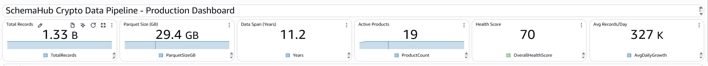
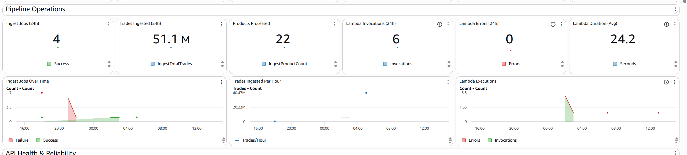
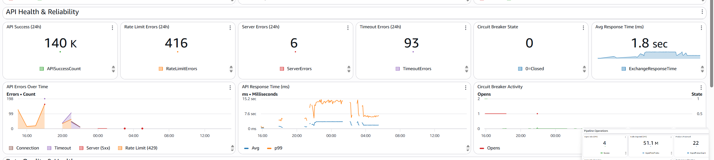
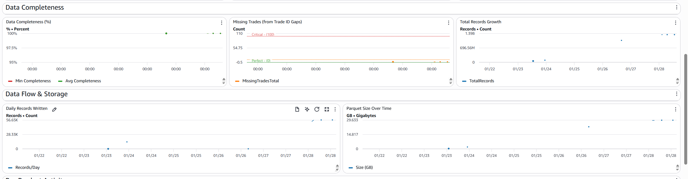
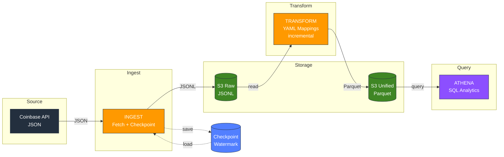
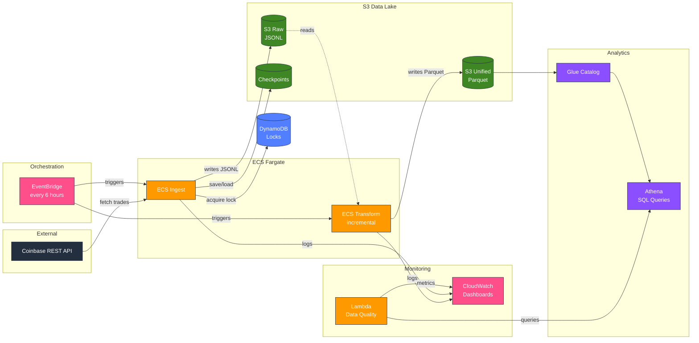
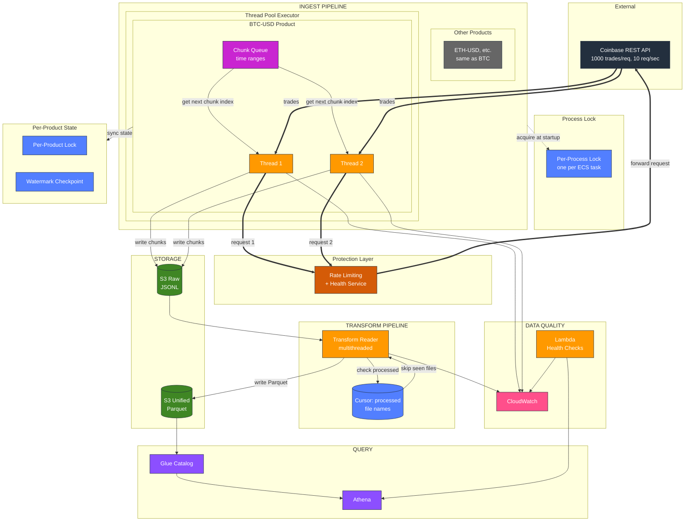
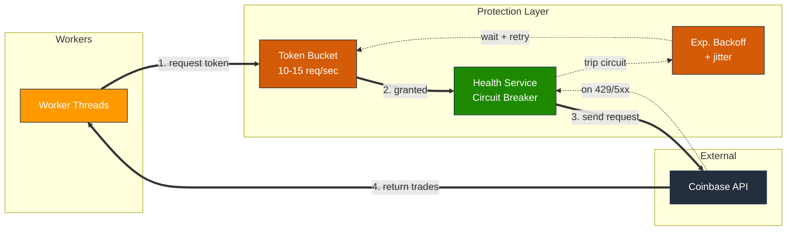
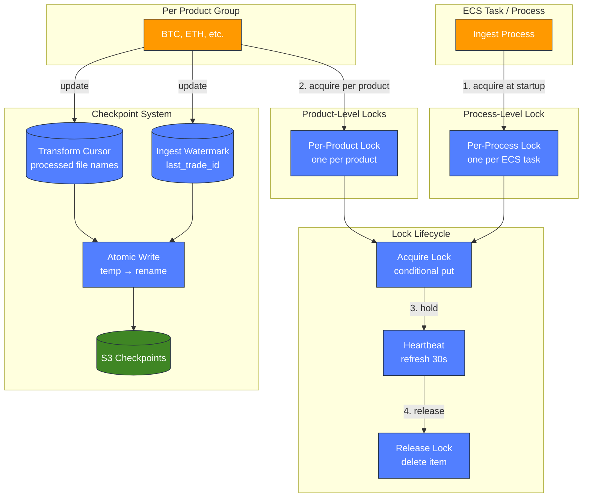

# Unified Crypto Data Platform

A production-grade mini data platform that normalizes multi-exchange crypto trade data into a single queryable table. See [Correctness Invariants](docs/CORRECTNESS_INVARIANTS.md) for detailed guarantees.

---

## Table of Contents

### 1. Overview
- [What You Get](#what-you-get)
- [Use Cases](#use-cases)
- [Unified Schema](#unified-schema)
- [Production Dashboard](#production-dashboard)
- [Key Features](#key-features)
- [Architecture at a Glance](#architecture-at-a-glance)

### 2. Getting Started
- [Quickstart](#quickstart)
- [Usage](#usage)
- [Configuration](#configuration)

### 3. Key Technical Details and Design
- [Architecture](#architecture)
- [Correctness & Reliability](#correctness--reliability)
- [Failure Modes & Recovery](#failure-modes--recovery)
- [Storage Layout](#storage-layout)
- [Out of Scope](#out-of-scope)

### 4. Additional Details
- [The Problem](#the-problem)
- [What Success Looks Like](#what-success-looks-like)
- [Deployment](#deployment)
- [Repository Layout](#repository-layout)
- [Roadmap](#roadmap)

### 5. Future Extensions
- [Performance Engineering](#performance-engineering)
- [Architecture Evolution](#architecture-evolution)
- [Feature Extensions](#feature-extensions)
- [Product Directions](#product-directions)
- [License / Credits](#license--credits)

---

## What You Get

| Artifact | Description | Format |
|----------|-------------|--------|
| **Unified Trade Data** | Normalized trades from multiple exchanges | Parquet (S3) |
| **Raw Audit Trail** | Immutable original API responses | JSONL (S3) |
| **SQL Analytics** | Query billions of trades in seconds | Athena |
| **Production Dashboard** | Real-time pipeline health monitoring | CloudWatch |
| **Infrastructure-as-Code** | One-command AWS deployment | Terraform |

---

## Use Cases

| Use Case | Who It's For | Value |
|----------|--------------|-------|
| **Algo Trading Backtests** | Quant traders | Reliable historical data without gaps |
| **Market Research** | Analysts, academics | Clean dataset for market microstructure research |
| **Compliance & Audit** | Crypto businesses | Immutable trade history with timestamps |
| **Free Data Alternative** | Individual developers | Replace Kaiko (~$500/mo), CoinGecko Pro |

---

## Unified Schema

Every trade, regardless of source exchange, is normalized to this schema:

| Column | Type | Description |
|--------|------|-------------|
| `exchange` | STRING | Source exchange (COINBASE, BINANCE, etc.) |
| `symbol` | STRING | Trading pair (BTC-USD, ETH-USD) |
| `trade_id` | STRING | Unique trade identifier |
| `side` | STRING | BUY or SELL |
| `price` | DOUBLE | Execution price |
| `quantity` | DOUBLE | Trade size |
| `trade_ts` | TIMESTAMP | When the trade executed |
| `ingest_ts` | TIMESTAMP | When this record was written |

---

## Demo

Live production dashboard running on AWS CloudWatch, updated every 3-6 hours via automated ECS schedules.

### Headline Stats


### Pipeline Operations


### API Health & Reliability


### Data Completeness & Storage


---

## Key Features

- ✅ **Multi-exchange support** — Unified schema across different exchanges (Coinbase, extensible to others)
- ✅ **Warehouse-ready output** — Parquet in S3 optimized for Snowflake COPY INTO ingestion
- ✅ **Multithreaded ingestion** — Parallel product workers + concurrent chunk fetching (configurable up to 200 threads)
- ✅ **Rate limiting & circuit breaker** — Automatic backoff prevents API throttling, graceful degradation
- ✅ **Cloud-deployed & monitored** — Running on AWS with operational dashboards, automated scheduling, and observability
- ✅ **Data quality monitoring** — Automated health checks, freshness alerts, duplicate detection via Lambda
- ✅ **Billions-scale** — Handles billions of trades across products
- ✅ **Zero data loss** — Monotonic watermarks guarantee no gaps or skipped trades
- ✅ **Deduplication ready** — Deterministic keys enable downstream deduplication
- ✅ **Idempotent & resumable** — Safe retries, resume from any failure point
- ✅ **Distributed locking** — DynamoDB-based locks prevent concurrent job conflicts
- ✅ **Cost-effective** — ~$10-15/month on AWS for full operation

---

## Architecture at a Glance



**Data Flow:**
1. **Ingest**: Fetch trades from Coinbase API using watermark checkpoints
2. **Raw Storage**: Immutable JSONL written to S3
3. **Transform**: YAML-based mapping normalizes schemas (incremental)
4. **Unified Storage**: Parquet tables for analytics
5. **Query**: SQL via AWS Athena

See [Architecture](#architecture) for detailed AWS infrastructure and internal component diagrams.

---

# 2. Getting Started

## Quickstart

**Prerequisites:** AWS account, S3 bucket, Docker

```bash
# Ingest trades
docker run YOUR_ECR_IMAGE python3 -m schemahub.cli ingest --s3-bucket BUCKET

# Transform to Parquet
docker run YOUR_ECR_IMAGE python3 -m schemahub.cli transform --s3-bucket BUCKET
```

---

## Usage

```bash
# Setup product list (one-time)
python3 -m schemahub.cli update-seed

# Ingest trades (incremental)
python3 -m schemahub.cli ingest --s3-bucket BUCKET

# Transform to Parquet (incremental)
python3 -m schemahub.cli transform --s3-bucket BUCKET
```

**Flags:** `--dry-run`, `--workers N`, `--chunk-concurrency N`

---

## Configuration

**Environment:** `S3_BUCKET`, `AWS_REGION`, `DYNAMODB_LOCKS_TABLE` (optional)

**S3 structure:**
```
s3://bucket/schemahub/
  ├── raw_coinbase_trades/    # JSONL
  ├── unified_trades/         # Parquet
  └── checkpoints/            # Watermarks
```

---


# 3. Key Technical Details and Design

---

## Architecture

### System Overview

| Layer | Component | Responsibility |
|-------|-----------|----------------|
| **Orchestration** | EventBridge + ECS | Schedule jobs every 6 hours, run containers |
| **Ingestion** | Connectors + ThreadPoolExecutor | Parallel workers, watermark checkpoints |
| **Protection** | Token Bucket + Circuit Breaker + DynamoDB | Rate limiting, backoff, distributed locks |
| **Storage** | S3 (Raw + Unified) | Immutable JSONL → queryable Parquet |
| **Transformation** | YAML Mappings + Transform Engine | Normalize schemas incrementally |
| **Query** | Athena + Glue | SQL analytics over Parquet |
| **Observability** | CloudWatch + Lambda | Logs, metrics, dashboards, data quality |

### AWS Infrastructure



### Detailed Internal Architecture



#### Protection Layer Detail



#### Checkpoint & Locking Detail



---

### Key Design Decisions

- **Watermark-based ingestion** — Incremental, resumable, no duplicates
- **Raw + Unified layers** — Immutable audit trail + flexible reprocessing
- **Deterministic S3 keys** — Idempotent writes; retries overwrite safely
- **Per-product checkpoints** — Parallel backfills without conflicts
- **YAML mappings** — Declarative, easy to extend for new sources
- **ECS over Lambda** — Longer timeouts, more memory for large batches
- **JSONL → Parquet** — Human-readable raw, 10x compressed analytics
- **Static thread pools** — Bottleneck is API rate limit, not local resources
- **Token bucket rate limiting** — Smooth request flow, respect API limits
- **Circuit breaker** — Back off on errors, prevent cascade failures

---

### Technologies

**Core:** Python 3.9+, Pydantic, PyArrow
**AWS:** ECS, EventBridge, S3, CloudWatch, Athena, Glue
**Format:** JSONL (raw), Parquet (unified)

---

### Concurrency & Performance

| Configuration | Threads | Use Case |
|---------------|---------|----------|
| `--workers 3 --chunk-concurrency 5` | 15 | Default |
| `--workers 5 --chunk-concurrency 9` | 45 | Optimal (saturates rate limit) |
| `--workers 10 --chunk-concurrency 20` | 200 | Backfill |

**Rate Limiting:** Token bucket (10-15 req/sec) + circuit breaker on repeated 429s.

See [Performance Guide](docs/PERFORMANCE.md) for Little's Law derivation, benchmarks, and tuning.

---

## Correctness & Reliability

| Guarantee | Mechanism |
|-----------|-----------|
| **Zero data loss** | Monotonic watermark checkpoints |
| **Zero duplicates** | Primary key dedup in unified layer |
| **Idempotent retries** | Deterministic S3 keys |
| **Resumable** | Per-product checkpoints |

See [CORRECTNESS_INVARIANTS.md](docs/CORRECTNESS_INVARIANTS.md) for detailed analysis.

---

## Failure Modes & Recovery

| Scenario | Outcome |
|----------|---------|
| Job crashes mid-write | Retry from checkpoint, no data loss |
| Job crashes after write | Re-fetch overlaps, dedup absorbs |
| API rate limited | Circuit breaker backs off, retries |
| Network timeout | Exponential backoff with jitter |
| Concurrent jobs | DynamoDB lock prevents race conditions |
| Cold start (no checkpoint) | Time guard limits to recent data |

---

## Storage Layout

```
s3://{bucket}/schemahub/
├── raw_coinbase_trades/           # Immutable JSONL
│   └── {product}/{timestamp}_{uuid}_{first_id}_{last_id}_{count}.jsonl
├── unified_trades/                # Queryable Parquet
│   └── v{version}/
│       ├── unified_trades_{timestamp}_{batch}.parquet
│       └── manifest.json          # Tracks processed files
└── checkpoints/                   # Watermarks
    └── {product}.json
```

---

## Out of Scope

- Real-time streaming (batch-oriented by design)
- Order book / L2 data (trades only)
- Trading execution / portfolio management
- Multi-tenant SaaS (single-user deployment)

---

# 4. Additional Details

See [Component Details](docs/COMPONENT_DETAILS.md) for module-level documentation.

---

## The Problem

There are many different sources of crypto data, from different exchanges:

**Schema chaos:** Every exchange uses different field names, timestamp formats, and data structures. Combining Coinbase + Binance data means writing custom parsers for each.

**No history:** APIs give you real-time data but not easy historical access. Run infrastructure 24/7 or lose data forever.

**Reliability is hard:** Without checkpoints you get duplicates or gaps. Retries are risky. Parallel ingestion causes race conditions.

**Expensive to DIY:** Building connectors, handling pagination, storing queryable data, managing infra—it adds up. Managed solutions (Fivetran, etc.) are pricey for individuals.

**Data is everything in crypto:** Without reliable historical data, you can't backtest strategies, analyze market patterns, or build meaningful analytics. Every gap or duplicate corrupts your analysis.


## What Success Looks Like

**Correctness:**
- Zero data loss (monotonic watermark, never skip trades)
- Deduplication ready (deterministic S3 keys enable downstream dedup)
- Idempotent retries (same run → same result)

**Performance:**
- Ingest: ~1-2 min for 30-min batch
- Backfill: 1M+ trades/hour per worker
- Queries: < 10 sec for 1B+ trades

**Cost:**
- ~$10 to backfill 100M trades
- ~$5/month for incremental updates (50 products, 30-min batches)
- 10x storage savings (Parquet vs JSON)

**UX:**
- < 10 min from zero to first query
- 3 CLI commands cover everything
- `--dry-run` flags for safety

**Operations:**
- No databases needed (checkpoints in S3)
- Stateless (works on AWS Glue/Lambda)
- One Docker image

---

## Deployment

**Infrastructure:** Terraform in `terraform/` directory

```bash
cd terraform
terraform init
terraform plan
terraform apply
```

**What gets created:**
- ECS Cluster + Task Definitions (ingest, transform)
- EventBridge Schedules (every 6 hours)
- S3 Bucket + Glue Database
- CloudWatch Dashboards + Alarms
- Lambda for data quality checks
- DynamoDB for distributed locking

**Cost:** ~$10-15/month for moderate usage

See [terraform/README.md](terraform/README.md) for full deployment guide.

### Cost Alerts

AWS Budgets alerts at configurable thresholds ($25, $50, $75...):

```hcl
# terraform.tfvars
billing_alert_email = "your-email@example.com"
billing_alert_threshold_increment = 25
```

---

## Repository Layout

```
schemahub/
├── schemahub/              # Core Python package
│   ├── cli.py              # CLI commands (ingest, transform, update-seed)
│   ├── connectors/         # Exchange connectors
│   ├── checkpoint.py       # Watermark & lock management
│   ├── rate_limiter.py     # Token bucket rate limiting
│   ├── health.py           # Circuit breaker
│   ├── transform.py        # JSONL → Parquet
│   └── metrics.py          # CloudWatch publishing
├── config/mappings/        # YAML schema mappings
├── terraform/              # Infrastructure as Code
├── tests/                  # Pytest test suite
└── docs/                   # Additional documentation
```

---

## Roadmap

- [ ] Multi-exchange support (Binance, Kraken)
- [ ] Real-time streaming ingestion
- [ ] Iceberg table format for ACID transactions
- [ ] Backtest analytics dashboard

---

# 5. Future Extensions

## Performance Engineering

### Transform Performance

- **Batch sizing controls** — Tune records per file, bytes per file, flush interval for optimal throughput
- **Benchmarking harnesses** — Create `bench/` with scan bench (query suite across layouts) and ingest bench (throughput stats over N-minute runs)

---

### Storage & I/O Performance

**I/O Optimization & Storage Layout Experiments:**
- **Parquet layout experiments** (storage + scan perf primary focus):
  - Create `layout_experiments/` harness to rewrite unified data into 4–6 layouts:
    - Row group sizes: 64MB, 128MB, 256MB, 512MB targets
    - Compression: Snappy vs ZSTD
    - Sort orders: `trade_ts` vs `(symbol, trade_ts)` vs `(symbol, exchange)`
  - Measure per layout: file size, Athena bytes scanned (for standard query suite), query latency
  - Use this as primary artifact for demonstrating storage + scan performance tuning
- **Profile S3 write bottleneck**: Current implementation caches 100K trades locally, then writes ~50MB to S3. This is likely the slowest part (1-2s per write). Consider:
  - Multipart uploads for large files
  - Parallel uploads to S3 (while still fetching new data)
  - Compression (GZIP) to reduce payload size
- **Raw data format choice**: Currently using JSONL. Evaluate **Parquet** for raw data lake:
  - **JSONL pros**: Human-readable, streaming-friendly, schema-less
  - **JSONL cons**: Large file size, slower parsing, less efficient for analytics
  - **Parquet pros**: 10x smaller files (compression), faster to read, native support in Athena/Spark
  - **Parquet cons**: Requires schema upfront, batch writes instead of streaming
  - **Recommendation**: Use Parquet for raw data lake; trades don't change, so schema is stable.

**Small Files → Compaction Loop (table format realism):**
- **Intentional microbatch compaction test**: Create pain and measure the fix:
  - Produce many small Parquet files in `state/` (e.g., one file per product per hour) to simulate realistic ingestion
  - Implement bin-pack compaction policies: "merge to 256MB files" or "compact per day per symbol bucket"
  - Measure: query planning time + execution time before/after compaction
  - Track file count and impact on Iceberg manifest size
- **Compaction instrumentation**: Log compaction cost (CPU, I/O, S3 request overhead) to understand economics

---

### Distributed Scaling

**Horizontal Scaling with ECS Tasks:**

Current architecture uses vertical scaling (single ECS task with `--workers` threading). Horizontal scaling launches N independent ECS tasks that self-coordinate via DynamoDB locks:

- Products are embarrassingly parallel — no cross-product dependencies
- Per-product locks already exist — tasks claim unclaimed products, skip others
- Idempotent writes — duplicate work is harmless

**Benefits:** Fargate Spot works better for smaller tasks, faster wall-clock completion, lower per-vCPU cost.

**When to use Spark/Ray instead:**

- ECS horizontal scaling is simpler (no cluster management)
- Spark/Ray add value for cross-product analytics, complex transforms, or shuffle-heavy workloads
- For embarrassingly parallel work like this, ECS is sufficient

---

## Architecture Evolution

### Table Formats & Partitioning

**Apache Iceberg / Delta Lake Migration:**
- Replace plain Parquet with Iceberg table format
- Native MERGE/UPSERT by PK without manual partition management
- Atomic commits, time travel, schema evolution
- File-level statistics for smart scan pruning
- Automatic compaction and garbage collection
- Requires: PyIceberg or Spark, Glue Iceberg catalog integration

**True Partition-Based Incremental Transform:**
- Partition unified Parquet by `trade_date` (derived from `trade_ts`)
- On each transform run, only read/merge/rewrite affected date partitions
- Enables true incremental by PK `(exchange, symbol, trade_id)` without full table scan
- Current approach uses Athena CTAS dedupe which scans entire table; partitioning scopes this to affected dates only
- Benefits: O(partition size) not O(table size), partition pruning for queries

**Partition Planning:**
- Automatically suggest partition specs for `trades_unified` based on data volume and query patterns

---

### Data Quality & Observability

- **Automatic Schema Evolution** — Detect new fields in raw data, auto-generate mapping config updates
- **Late-Arriving Data Handling** — Track both `last_trade_id` and `last_ts` per source for out-of-order ingestion

---

### Orchestration & Workflow

**Orchestration & Workflow Management (Prefect, Dagster, or Airflow):**

**Why orchestration?** Currently, ingestion and backfill jobs are manually triggered or scheduled via AWS Glue/cron. An orchestration framework would provide:
- **Unified pipeline management**: Define the entire flow (fetch product seed → ingest/backfill → unify → validate) as a DAG (directed acyclic graph) with clear dependencies.
- **Centralized monitoring & alerting**: Track job status, failure rates, and duration across all data sources in a single dashboard. Alert on failures or SLA violations.
- **Automated retry & recovery**: Built-in exponential backoff, multi-attempt handling, and task-level recovery without manual intervention.
- **Data lineage & audit trails**: Track which trades came from which API calls, when they were ingested, and how they flowed through transformations.
- **Cost optimization**: Visualize resource usage per job (API calls, S3 writes, compute), optimize worker counts and batch sizes.
- **Incremental backfill orchestration**: Automatically parallelize backfills across products, manage concurrency, and resume from checkpoints without manual CLI invocation.
- **Multi-source coordination**: When adding new exchanges (Kraken, Binance, etc.), orchestrate their ingestion, unification, and data quality checks as a single cohesive workflow.
- **Scheduling flexibility**: Beyond simple cron, support event-driven triggers (e.g., "ingest when product list changes") and dynamic scheduling based on data volumes.

**Tool recommendations:**
- **Prefect** (lightweight, Python-native, modern UI): Best for rapid development and dynamic workflows.
- **Dagster** (comprehensive, strong data assets, excellent observability): Best for long-term maintainability and complex multi-source pipelines.
- **Apache Airflow** (battle-tested, ecosystem-rich): Best if scaling to enterprise complexity with large teams.

**Atomic Multi-Source Commits:**
- Ingest from multiple exchanges, unify, and publish as a single Iceberg snapshot

---

## Feature Extensions

### New Data Types

**Level 2 (L2) Order Book Data via WebSockets:**
- Extend the platform to ingest **real-time L2 order book data** (bid/ask depth) via Coinbase WebSocket feeds.
- **Why this is compelling**: L2 data is significantly larger and more complex than trade data—capturing order book snapshots and deltas at millisecond granularity would demonstrate the platform's ability to handle high-throughput, low-latency streaming workloads.
- **Data volume**: A single day of L2 data across major trading pairs could easily exceed 100GB+ of raw data, orders of magnitude larger than trade data alone.
- **Use cases**: Order flow analysis, market microstructure research, liquidity metrics, spread analysis, and ML features for price prediction.
- **Implementation**: WebSocket client for Coinbase's `level2` channel, efficient delta processing, and optimized Parquet storage for time-series order book snapshots.
- **Resource requirements**: Modest compute (a small EC2 instance or local machine) could handle ingestion for a single day demo—cost would be minimal (~$1-5 for a full day of data collection).

---

### Multi-Exchange & Scale

**Scale to Many Products (early demand test):**
- Currently testing with a handful of products (e.g., BTC-USD, ETH-USD). Scale to 50–100+ Coinbase products to test:
  - Checkpoint file count and manifest overhead (does resuming get slower?)
  - Thread pool contention and queueing behavior under load
  - S3 request rate limits (429s) and retry backoff effectiveness
  - Memory footprint with many concurrent fetch/write buffers
  - Query planning time in Athena as file counts grow
- This cheap test reveals bottlenecks early (API rate limiting, S3 throughput, memory, Iceberg metadata scaling) before building out distributed infrastructure.

---

## Product Directions

Potential business directions building on this platform:

- **AI/ML Features** — Price movement forecasting, anomaly detection on trade patterns, automated trading signals. The unified data lake makes ML pipelines straightforward.

- **BYO-Keys Exchange Gateway** — Multi-tenant service where users bring their own API keys to trade across exchanges through a single unified API. Builds on [CCXT](https://github.com/ccxt/ccxt) for exchange connectivity, adds circuit breakers, idempotency for order safety, per-user rate limiting, and usage-based billing.

- **Backtest-as-a-Service** — Hosted backtesting engine that runs user strategies against the historical trade archive. Charge per backtest or subscription.

- **Data API / Marketplace** — Sell access to the normalized trade data via API. Compete with Kaiko, CoinGecko Pro on price.

- **Real-Time Signals Feed** — WebSocket service pushing trade anomalies, volume spikes, or custom alerts. Subscription model.

---

## License / Credits

MIT License

Built with: Python, AWS (ECS, S3, Athena, EventBridge), Terraform


---


