# Unified Crypto Data Platform

A production-grade mini data platform that normalizes multi-exchange crypto trade data into a single queryable table. See [Correctness Invariants](docs/CORRECTNESS_INVARIANTS.md) for detailed guarantees.

---

## Table of Contents

### 1. Overview
- [What You Get](#what-you-get)
- [Use Cases](#use-cases)
- [Unified Schema](#unified-schema)
- [Production Dashboard](#production-dashboard)
- [Key Features](#key-features)
- [Architecture at a Glance](#architecture-at-a-glance)

### 2. Getting Started
- [Quickstart](#quickstart)
- [Usage](#usage)
- [Configuration](#configuration)

### 3. Key Technical Details and Design
- [Architecture](#architecture)
- [Correctness & Reliability](#correctness--reliability)
- [Failure Modes & Recovery](#failure-modes--recovery)
- [Storage Layout](#storage-layout)
- [Out of Scope](#out-of-scope)

### 4. Additional Details
- [The Problem](#the-problem)
- [What Success Looks Like](#what-success-looks-like)
- [Deployment](#deployment)
- [Repository Layout](#repository-layout)
- [Roadmap](#roadmap)

### 5. Future Extensions & Learning
- [Performance Engineering](#performance-engineering)
- [Architecture Evolution](#architecture-evolution)
- [Feature Extensions](#feature-extensions)
- [Product Directions](#product-directions)
- [Learning Path: Storage & Lake Internals](#learning-path-storage--lake-internals)
- [License / Credits](#license--credits)

---

## What You Get

| Artifact | Description | Format |
|----------|-------------|--------|
| **Unified Trade Data** | Normalized trades from multiple exchanges | Parquet (S3) |
| **Raw Audit Trail** | Immutable original API responses | JSONL (S3) |
| **SQL Analytics** | Query billions of trades in seconds | Athena |
| **Production Dashboard** | Real-time pipeline health monitoring | CloudWatch |
| **Infrastructure-as-Code** | One-command AWS deployment | Terraform |

---

## Use Cases

| Use Case | Who It's For | Value |
|----------|--------------|-------|
| **Algo Trading Backtests** | Quant traders | Reliable historical data without gaps |
| **Market Research** | Analysts, academics | Clean dataset for market microstructure research |
| **Compliance & Audit** | Crypto businesses | Immutable trade history with timestamps |
| **Free Data Alternative** | Individual developers | Replace Kaiko (~$500/mo), CoinGecko Pro |

---

## Unified Schema

Every trade, regardless of source exchange, is normalized to this schema:

| Column | Type | Description |
|--------|------|-------------|
| `exchange` | STRING | Source exchange (COINBASE, BINANCE, etc.) |
| `symbol` | STRING | Trading pair (BTC-USD, ETH-USD) |
| `trade_id` | STRING | Unique trade identifier |
| `side` | STRING | BUY or SELL |
| `price` | DOUBLE | Execution price |
| `quantity` | DOUBLE | Trade size |
| `trade_ts` | TIMESTAMP | When the trade executed |
| `ingest_ts` | TIMESTAMP | When this record was written |

---

## Demo

Live production dashboard running on AWS CloudWatch, updated every 3-6 hours via automated ECS schedules.

### Headline Stats


### Pipeline Operations


### API Health & Reliability


### Data Completeness & Storage


---

## Key Features

- ✅ **Multi-exchange support** — Unified schema across different exchanges (Coinbase, extensible to others)
- ✅ **Warehouse-ready output** — Parquet in S3 optimized for Snowflake COPY INTO ingestion
- ✅ **Multithreaded ingestion** — Parallel product workers + concurrent chunk fetching (configurable up to 200 threads)
- ✅ **Rate limiting & circuit breaker** — Automatic backoff prevents API throttling, graceful degradation
- ✅ **Cloud-deployed & monitored** — Running on AWS with operational dashboards, automated scheduling, and observability
- ✅ **Data quality monitoring** — Automated health checks, freshness alerts, duplicate detection via Lambda
- ✅ **Billions-scale** — Handles billions of trades across products
- ✅ **Zero data loss** — Monotonic watermarks guarantee no gaps or skipped trades
- ✅ **Deduplication ready** — Deterministic keys enable downstream deduplication
- ✅ **Idempotent & resumable** — Safe retries, resume from any failure point
- ✅ **Distributed locking** — DynamoDB-based locks prevent concurrent job conflicts
- ✅ **Cost-effective** — ~$10-15/month on AWS for full operation

---

## Architecture at a Glance


**Data Flow:**
1. **Ingest**: Fetch trades from Coinbase API using watermark checkpoints
2. **Raw Storage**: Immutable JSONL written to S3
3. **Transform**: YAML-based mapping normalizes schemas (incremental)
4. **Unified Storage**: Parquet tables for analytics
5. **Query**: SQL via AWS Athena

See [Architecture](#architecture) for detailed AWS infrastructure and internal component diagrams.

---

# 2. Getting Started

## Quickstart

**Prerequisites:** AWS account, S3 bucket, Docker

```bash
# Ingest trades
docker run YOUR_ECR_IMAGE python3 -m schemahub.cli ingest --s3-bucket BUCKET

# Transform to Parquet
docker run YOUR_ECR_IMAGE python3 -m schemahub.cli transform --s3-bucket BUCKET
```

---

## Usage

```bash
# Setup product list (one-time)
python3 -m schemahub.cli update-seed

# Ingest trades (incremental)
python3 -m schemahub.cli ingest --s3-bucket BUCKET

# Transform to Parquet (incremental)
python3 -m schemahub.cli transform --s3-bucket BUCKET
```

**Flags:** `--dry-run`, `--workers N`, `--chunk-concurrency N`

---

## Configuration

**Environment:** `S3_BUCKET`, `AWS_REGION`, `DYNAMODB_LOCKS_TABLE` (optional)

**S3 structure:**
```
s3://bucket/schemahub/
  ├── raw_coinbase_trades/    # JSONL
  ├── unified_trades/         # Parquet
  └── checkpoints/            # Watermarks
```

---


# 3. Key Technical Details and Design

---

## Architecture

### System Overview

| Layer | Component | Responsibility |
|-------|-----------|----------------|
| **Orchestration** | EventBridge + ECS | Schedule jobs every 6 hours, run containers |
| **Ingestion** | Connectors + ThreadPoolExecutor | Parallel workers, watermark checkpoints |
| **Protection** | Token Bucket + Circuit Breaker + DynamoDB | Rate limiting, backoff, distributed locks |
| **Storage** | S3 (Raw + Unified) | Immutable JSONL → queryable Parquet |
| **Transformation** | YAML Mappings + Transform Engine | Normalize schemas incrementally |
| **Query** | Athena + Glue | SQL analytics over Parquet |
| **Observability** | CloudWatch + Lambda | Logs, metrics, dashboards, data quality |

### AWS Infrastructure


### Detailed Internal Architecture


#### Protection Layer Detail


#### Checkpoint & Locking Detail

```mermaid
flowchart TB
    subgraph ECS_TASK[ECS Task / Process]
        PROC[Ingest Process]
    end

    subgraph ProductGroup[Per Product Group]
        PG[BTC, ETH, etc.]
    end

    subgraph PROC_LOCKING[Process-Level Lock]
        PRL[Per-Process Lock<br/>one per ECS task]
    end

    subgraph PRODUCT_LOCKING[Product-Level Locks]
        PDL[Per-Product Lock<br/>one per product]
    end

    subgraph LOCK_LIFECYCLE[Lock Lifecycle]
        ACQ[Acquire Lock<br/>conditional put]
        HB[Heartbeat<br/>refresh 30s]
        REL[Release Lock<br/>delete item]
    end

    subgraph Checkpoint[Checkpoint System]
        WM[(Ingest Watermark<br/>last_trade_id)]
        TC[(Transform Cursor<br/>processed file names)]
        AW[Atomic Write<br/>temp → rename]
        CHKS[(S3 Checkpoints)]
    end

    %% Process lock (once at startup)
    PROC -->|1. acquire at startup| PRL
    PRL --> ACQ

    %% Product lock (per product)
    PG -->|2. acquire per product| PDL
    PDL --> ACQ

    %% Lock lifecycle
    ACQ -->|3. hold| HB
    HB -->|4. release| REL

    %% Checkpoint flow
    PG -->|update| WM
    PG -->|update| TC
    WM --> AW
    TC --> AW
    AW --> CHKS

    style PROC fill:#FF9900,stroke:#232F3E,color:#fff
    style PG fill:#FF9900,stroke:#232F3E,color:#fff
    style PRL fill:#527FFF,stroke:#232F3E,color:#fff
    style PDL fill:#527FFF,stroke:#232F3E,color:#fff
    style ACQ fill:#527FFF,stroke:#232F3E,color:#fff
    style HB fill:#527FFF,stroke:#232F3E,color:#fff
    style REL fill:#527FFF,stroke:#232F3E,color:#fff
    style WM fill:#527FFF,stroke:#232F3E,color:#fff
    style TC fill:#527FFF,stroke:#232F3E,color:#fff
    style AW fill:#527FFF,stroke:#232F3E,color:#fff
    style CHKS fill:#3F8624,stroke:#232F3E,color:#fff
```



---

### Key Design Decisions

- **Watermark-based ingestion** — Incremental, resumable, no duplicates
- **Raw + Unified layers** — Immutable audit trail + flexible reprocessing
- **Deterministic S3 keys** — Idempotent writes; retries overwrite safely
- **Per-product checkpoints** — Parallel backfills without conflicts
- **YAML mappings** — Declarative, easy to extend for new sources
- **ECS over Lambda** — Longer timeouts, more memory for large batches
- **JSONL → Parquet** — Human-readable raw, 10x compressed analytics
- **Static thread pools** — Bottleneck is API rate limit, not local resources
- **Token bucket rate limiting** — Smooth request flow, respect API limits
- **Circuit breaker** — Back off on errors, prevent cascade failures

---

### Technologies

**Core:** Python 3.9+, Pydantic, PyArrow
**AWS:** ECS, EventBridge, S3, CloudWatch, Athena, Glue
**Format:** JSONL (raw), Parquet (unified)

---

### Concurrency & Performance

| Configuration | Threads | Use Case |
|---------------|---------|----------|
| `--workers 3 --chunk-concurrency 5` | 15 | Default |
| `--workers 5 --chunk-concurrency 9` | 45 | Optimal (saturates rate limit) |
| `--workers 10 --chunk-concurrency 20` | 200 | Backfill |

**Rate Limiting:** Token bucket (10-15 req/sec) + circuit breaker on repeated 429s.

See [Performance Guide](docs/PERFORMANCE.md) for Little's Law derivation, benchmarks, and tuning.

---

## Correctness & Reliability

| Guarantee | Mechanism |
|-----------|-----------|
| **Zero data loss** | Monotonic watermark checkpoints |
| **Zero duplicates** | Primary key dedup in unified layer |
| **Idempotent retries** | Deterministic S3 keys |
| **Resumable** | Per-product checkpoints |

See [CORRECTNESS_INVARIANTS.md](docs/CORRECTNESS_INVARIANTS.md) for detailed analysis.

---

## Failure Modes & Recovery

| Scenario | Outcome |
|----------|---------|
| Job crashes mid-write | Retry from checkpoint, no data loss |
| Job crashes after write | Re-fetch overlaps, dedup absorbs |
| API rate limited | Circuit breaker backs off, retries |
| Network timeout | Exponential backoff with jitter |
| Concurrent jobs | DynamoDB lock prevents race conditions |
| Cold start (no checkpoint) | Time guard limits to recent data |

---

## Storage Layout

```
s3://{bucket}/schemahub/
├── raw_coinbase_trades/           # Immutable JSONL
│   └── {product}/{timestamp}_{uuid}_{first_id}_{last_id}_{count}.jsonl
├── unified_trades/                # Queryable Parquet
│   └── v{version}/
│       ├── unified_trades_{timestamp}_{batch}.parquet
│       └── manifest.json          # Tracks processed files
└── checkpoints/                   # Watermarks
    └── {product}.json
```

---

## Out of Scope

- Real-time streaming (batch-oriented by design)
- Order book / L2 data (trades only)
- Trading execution / portfolio management
- Multi-tenant SaaS (single-user deployment)

---

# 4. Additional Details

See [Component Details](docs/COMPONENT_DETAILS.md) for module-level documentation.

---

## The Problem

There are many different sources of crypto data, from different exchanges:

**Schema chaos:** Every exchange uses different field names, timestamp formats, and data structures. Combining Coinbase + Binance data means writing custom parsers for each.

**No history:** APIs give you real-time data but not easy historical access. Run infrastructure 24/7 or lose data forever.

**Reliability is hard:** Without checkpoints you get duplicates or gaps. Retries are risky. Parallel ingestion causes race conditions.

**Expensive to DIY:** Building connectors, handling pagination, storing queryable data, managing infra—it adds up. Managed solutions (Fivetran, etc.) are pricey for individuals.

**Data is everything in crypto:** Without reliable historical data, you can't backtest strategies, analyze market patterns, or build meaningful analytics. Every gap or duplicate corrupts your analysis.


## What Success Looks Like

**Correctness:**
- Zero data loss (monotonic watermark, never skip trades)
- Deduplication ready (deterministic S3 keys enable downstream dedup)
- Idempotent retries (same run → same result)

**Performance:**
- Ingest: ~1-2 min for 30-min batch
- Backfill: 1M+ trades/hour per worker
- Queries: < 10 sec for 1B+ trades

**Cost:**
- ~$10 to backfill 100M trades
- ~$5/month for incremental updates (50 products, 30-min batches)
- 10x storage savings (Parquet vs JSON)

**UX:**
- < 10 min from zero to first query
- 3 CLI commands cover everything
- `--dry-run` flags for safety

**Operations:**
- No databases needed (checkpoints in S3)
- Stateless (works on AWS Glue/Lambda)
- One Docker image

---

## Deployment

**Infrastructure:** Terraform in `terraform/` directory

```bash
cd terraform
terraform init
terraform plan
terraform apply
```

**What gets created:**
- ECS Cluster + Task Definitions (ingest, transform)
- EventBridge Schedules (every 6 hours)
- S3 Bucket + Glue Database
- CloudWatch Dashboards + Alarms
- Lambda for data quality checks
- DynamoDB for distributed locking

**Cost:** ~$10-15/month for moderate usage

See [terraform/README.md](terraform/README.md) for full deployment guide.

### Cost Alerts

AWS Budgets alerts at configurable thresholds ($25, $50, $75...):

```hcl
# terraform.tfvars
billing_alert_email = "your-email@example.com"
billing_alert_threshold_increment = 25
```

---

## Repository Layout

```
schemahub/
├── schemahub/              # Core Python package
│   ├── cli.py              # CLI commands (ingest, transform, update-seed)
│   ├── connectors/         # Exchange connectors
│   ├── checkpoint.py       # Watermark & lock management
│   ├── rate_limiter.py     # Token bucket rate limiting
│   ├── health.py           # Circuit breaker
│   ├── transform.py        # JSONL → Parquet
│   └── metrics.py          # CloudWatch publishing
├── config/mappings/        # YAML schema mappings
├── terraform/              # Infrastructure as Code
├── tests/                  # Pytest test suite
└── docs/                   # Additional documentation
```

---

## Roadmap

- [ ] Multi-exchange support (Binance, Kraken)
- [ ] Real-time streaming ingestion
- [ ] Iceberg table format for ACID transactions
- [ ] Backtest analytics dashboard

---

# 5. Future Extensions & Learning

## Performance Engineering

### Ingestion Performance

**Parallelized Ingestion Within a Single Product:**
- **Current state**: Ingestion fetches trades sequentially—one API request completes before the next begins. The bottleneck is network I/O wait time, not CPU.
- **Opportunity**: Use concurrency to overlap API requests. Since we already track average request latency in metrics, we can calculate expected speedup using **Little's Law / concurrency math**:
  - If average request takes 200ms and we run 5 concurrent requests, theoretical throughput = 5x (limited by API rate limits)
  - Expected improvement: `speedup = min(concurrency_level, rate_limit / avg_requests_per_sec)`
- **Implementation approach**:
  - Use `asyncio` with `aiohttp` or `concurrent.futures.ThreadPoolExecutor`
  - Partition the trade ID range into chunks, fetch chunks in parallel
  - Merge results while preserving monotonic order for checkpoint updates
  - Respect Coinbase rate limits (~10 req/sec) to avoid 429s
- **Measurement plan**:
  1. Baseline: Record current avg request time and total backfill duration
  2. Calculate expected improvement using concurrency formula
  3. Implement parallel fetching with configurable concurrency (e.g., `--parallel 5`)
  4. Measure actual improvement and compare to prediction
  5. Tune concurrency level based on real-world rate limit behavior
- **Expected outcome**: 3-5x speedup on backfills (from hours to minutes for large products like BTC-USD)

**API & Network Performance:**
- **Async/concurrent API calls within a product**: Currently, one product uses a single thread fetching trades sequentially. Implement `asyncio` or thread pools to fetch multiple trade IDs in parallel (e.g., fetch BTC trades AND ETH trades at the same time per worker).
- **Connection pooling & keep-alive**: Ensure `requests.Session` is properly using HTTP keep-alive to reuse TCP connections.
- **Adaptive backoff**: Implement exponential backoff for rate-limited or slow API responses instead of fixed 5s timeout.
- **Batch API requests**: If Coinbase offers bulk endpoints, use them instead of per-product requests.

**Checkpoint & Resume:**
- **Distributed checkpointing**: Multi-writer safety when scaling to many workers.
- **Checkpoint validation**: Detect and recover from corrupted checkpoints.

---

### Transform Performance

**Transform Pipeline Optimization:**
- **Incremental transform instead of full refresh**: Currently, the transform reads ALL raw JSONL files and retransforms them on every run (full refresh). For better performance and cost, implement incremental processing:
  - Use the manifest to track which raw files have already been transformed
  - On each run, only read raw files newer than the last checkpoint
  - Append new unified trades to existing Parquet files (or create new versioned files)
  - This reduces compute time from minutes to seconds for normal hourly runs, while `--rebuild` flag still supports full retransform when needed (e.g., after schema changes)

**Throughput Engineering as Explicit Subsystem:**
- **Stage model instrumentation** (fetch → transform → upload → commit):
  - Bound in-memory buffers to implement backpressure (prevent unbounded queue growth)
  - Separate thread pools for API fetch vs S3 write operations
  - Batch sizing controls: records per file, bytes per file, flush interval
  - Adaptive retry/backoff for 429s and timeouts
- **Measure steady-state performance**:
  - Trades/sec throughput
  - p95 API latency per fetch batch
  - Write throughput (MB/s to S3)
  - S3 request rate (multipart parts/sec)
  - Time spent in Iceberg commit vs data write (break down metadata overhead)
- **Create `bench/` harnesses**: scan bench (fixed query suite against each layout) + ingest bench (N-minute ingest run with queue/throughput stats)

---

### Storage & I/O Performance

**I/O Optimization & Storage Layout Experiments:**
- **Parquet layout experiments** (storage + scan perf primary focus):
  - Create `layout_experiments/` harness to rewrite unified data into 4–6 layouts:
    - Row group sizes: 64MB, 128MB, 256MB, 512MB targets
    - Compression: Snappy vs ZSTD
    - Sort orders: `trade_ts` vs `(symbol, trade_ts)` vs `(symbol, exchange)`
  - Measure per layout: file size, Athena bytes scanned (for standard query suite), query latency
  - Use this as primary artifact for demonstrating storage + scan performance tuning
- **Profile S3 write bottleneck**: Current implementation caches 100K trades locally, then writes ~50MB to S3. This is likely the slowest part (1-2s per write). Consider:
  - Multipart uploads for large files
  - Parallel uploads to S3 (while still fetching new data)
  - Compression (GZIP) to reduce payload size
- **Raw data format choice**: Currently using JSONL. Evaluate **Parquet** for raw data lake:
  - **JSONL pros**: Human-readable, streaming-friendly, schema-less
  - **JSONL cons**: Large file size, slower parsing, less efficient for analytics
  - **Parquet pros**: 10x smaller files (compression), faster to read, native support in Athena/Spark
  - **Parquet cons**: Requires schema upfront, batch writes instead of streaming
  - **Recommendation**: Use Parquet for raw data lake; trades don't change, so schema is stable.

**Small Files → Compaction Loop (table format realism):**
- **Intentional microbatch compaction test**: Create pain and measure the fix:
  - Produce many small Parquet files in `state/` (e.g., one file per product per hour) to simulate realistic ingestion
  - Implement bin-pack compaction policies: "merge to 256MB files" or "compact per day per symbol bucket"
  - Measure: query planning time + execution time before/after compaction
  - Track file count and impact on Iceberg manifest size
- **Compaction instrumentation**: Log compaction cost (CPU, I/O, S3 request overhead) to understand economics

---

### Distributed Scaling

**Horizontal Scaling with ECS Tasks (Scale Out):**

The current architecture uses **vertical scaling** (single ECS task with internal `--workers` threading). For better cost efficiency and throughput, horizontal scaling launches multiple independent ECS tasks:

- **Current (Scale Up):** 1 ECS task → ThreadPool → N products in parallel
- **Proposed (Scale Out):** N ECS tasks → each claims/processes products independently

**Why this works easily:**
- Products are **embarrassingly parallel** (no cross-product dependencies)
- **DynamoDB per-product locks already exist** — workers can self-coordinate by claiming unclaimed products
- **Checkpointing is per-product** — no shared state between workers
- **Idempotent writes** — duplicate work is harmless (same JSONL files get overwritten)

**Implementation approach:**
1. Launch N ECS tasks (via EventBridge or Step Functions fan-out)
2. Each task loads the product seed file
3. Each task attempts to acquire per-product locks via DynamoDB
4. Tasks that acquire a lock process that product; others skip and try the next
5. Tasks exit when no unclaimed products remain

**Cost benefits:**
- Fargate Spot availability is better for smaller tasks (less interruption risk)
- N small tasks for 6 minutes each ≈ same compute as 1 large task for 60 minutes
- Lower per-vCPU-hour cost at smaller task sizes
- Faster completion (wall-clock time) for backfills

**Transform job scaling:**
- Transform is also parallelizable since it's per-file/per-product (no cross-product joins)
- Same pattern: multiple tasks claim raw files via manifest/lock, process independently
- Simpler than Spark since there's no shuffle/reduce phase

**Comparison to Spark/Ray:**
- ECS horizontal scaling is **simpler** (no cluster management, no driver coordination)
- Spark/Ray provide **more features** (automatic shuffle, fault tolerance, data locality)
- For this use case (embarrassingly parallel, no aggregations), ECS is sufficient
- Spark becomes valuable when adding cross-product analytics or complex transforms

**Alternative: PySpark or Ray for complex pipelines:**
- For larger scale operations with complex transforms, consider **PySpark** (for Spark clusters) or **Ray** (for distributed Python execution)
- These provide: automatic shuffle/reduce, fault tolerance, data locality optimization
- Useful when adding cross-product analytics (e.g., correlation analysis, aggregations across symbols)

---

## Architecture Evolution

### Table Formats & Partitioning

**Apache Iceberg / Delta Lake Migration:**
- Replace plain Parquet with Iceberg table format
- Native MERGE/UPSERT by PK without manual partition management
- Atomic commits, time travel, schema evolution
- File-level statistics for smart scan pruning
- Automatic compaction and garbage collection
- Requires: PyIceberg or Spark, Glue Iceberg catalog integration

**True Partition-Based Incremental Transform:**
- Partition unified Parquet by `trade_date` (derived from `trade_ts`)
- On each transform run, only read/merge/rewrite affected date partitions
- Enables true incremental by PK `(exchange, symbol, trade_id)` without full table scan
- Current approach uses Athena CTAS dedupe which scans entire table; partitioning scopes this to affected dates only
- Benefits: O(partition size) not O(table size), partition pruning for queries

**Parquet Partitioning by Symbol:**
- Partition unified Parquet output by `symbol=X/` folders for query pruning
- 10-100x faster Athena queries on specific symbols, lower cost (scan less data)
- Consider `symbol + date` double-partitioning for high-volume symbols

**Partition Planning:**
- Automatically suggest partition specs for `trades_unified` based on data volume and query patterns

---

### Data Quality & Observability

**Operational Metrics Dashboard:**
- After the pipeline runs for 1-2 weeks, create visualizations to demonstrate system efficiency and reliability:
  - Data volume growth trends (cumulative records over time)
  - Storage efficiency (raw JSONL vs Parquet size, compression ratio)
  - Pipeline success rate and failure patterns
  - Records per source/product distribution
  - Processing speed trends (records/second)
  - Data freshness metrics (latest trade timestamp)
  - Scan performance metrics: bytes scanned per query, latency trends across layouts
  - Throughput metrics: trades/sec, p95 API latency, MB/s write rate over time
- Use Athena to query operational data and build simple charts for portfolio/resume demonstration.

**Automatic Schema Evolution:**
- Detect new fields in raw tables
- Propose or auto-generate updates to mapping configs + unified schema

**Advanced Incremental Ingestion:**
- Store both `last_trade_id` and `last_ts` per source
- Handle late-arriving data

---

### Orchestration & Workflow

**Orchestration & Workflow Management (Prefect, Dagster, or Airflow):**

**Why orchestration?** Currently, ingestion and backfill jobs are manually triggered or scheduled via AWS Glue/cron. An orchestration framework would provide:
- **Unified pipeline management**: Define the entire flow (fetch product seed → ingest/backfill → unify → validate) as a DAG (directed acyclic graph) with clear dependencies.
- **Centralized monitoring & alerting**: Track job status, failure rates, and duration across all data sources in a single dashboard. Alert on failures or SLA violations.
- **Automated retry & recovery**: Built-in exponential backoff, multi-attempt handling, and task-level recovery without manual intervention.
- **Data lineage & audit trails**: Track which trades came from which API calls, when they were ingested, and how they flowed through transformations.
- **Cost optimization**: Visualize resource usage per job (API calls, S3 writes, compute), optimize worker counts and batch sizes.
- **Incremental backfill orchestration**: Automatically parallelize backfills across products, manage concurrency, and resume from checkpoints without manual CLI invocation.
- **Multi-source coordination**: When adding new exchanges (Kraken, Binance, etc.), orchestrate their ingestion, unification, and data quality checks as a single cohesive workflow.
- **Scheduling flexibility**: Beyond simple cron, support event-driven triggers (e.g., "ingest when product list changes") and dynamic scheduling based on data volumes.

**Tool recommendations:**
- **Prefect** (lightweight, Python-native, modern UI): Best for rapid development and dynamic workflows.
- **Dagster** (comprehensive, strong data assets, excellent observability): Best for long-term maintainability and complex multi-source pipelines.
- **Apache Airflow** (battle-tested, ecosystem-rich): Best if scaling to enterprise complexity with large teams.

**Atomic Multi-Source Commits:**
- Ingest from multiple exchanges, unify, and publish as a single Iceberg snapshot

---

## Feature Extensions

### New Data Types

**Level 2 (L2) Order Book Data via WebSockets:**
- Extend the platform to ingest **real-time L2 order book data** (bid/ask depth) via Coinbase WebSocket feeds.
- **Why this is compelling**: L2 data is significantly larger and more complex than trade data—capturing order book snapshots and deltas at millisecond granularity would demonstrate the platform's ability to handle high-throughput, low-latency streaming workloads.
- **Data volume**: A single day of L2 data across major trading pairs could easily exceed 100GB+ of raw data, orders of magnitude larger than trade data alone.
- **Use cases**: Order flow analysis, market microstructure research, liquidity metrics, spread analysis, and ML features for price prediction.
- **Implementation**: WebSocket client for Coinbase's `level2` channel, efficient delta processing, and optimized Parquet storage for time-series order book snapshots.
- **Resource requirements**: Modest compute (a small EC2 instance or local machine) could handle ingestion for a single day demo—cost would be minimal (~$1-5 for a full day of data collection).

---

### Multi-Exchange & Scale

**Scale to Many Products (early demand test):**
- Currently testing with a handful of products (e.g., BTC-USD, ETH-USD). Scale to 50–100+ Coinbase products to test:
  - Checkpoint file count and manifest overhead (does resuming get slower?)
  - Thread pool contention and queueing behavior under load
  - S3 request rate limits (429s) and retry backoff effectiveness
  - Memory footprint with many concurrent fetch/write buffers
  - Query planning time in Athena as file counts grow
- This cheap test reveals bottlenecks early (API rate limiting, S3 throughput, memory, Iceberg metadata scaling) before building out distributed infrastructure.

---

### Other Domains

**More Domains:**
- Reuse the same pattern for e-commerce events, ad impressions, etc. Only the connectors, mappings, and target schema change.

**Infrastructure as Code (Terraform):**
- Create Terraform modules to automate provisioning of AWS resources (S3 buckets, IAM roles, Glue jobs, Iceberg catalogs).
- Enable reproducible, version-controlled infrastructure deployments and easy multi-environment setups (dev, staging, prod).

---

## Product Directions

### AI/ML Features

**🤖 AI/ML Features Have Highest ROI:** Adding predictive models (price movement forecasting, anomaly detection on trade patterns, automated trading signals) would be the highest-impact enhancement. The unified data lake + historical archive makes this feasible immediately post-MVP.

---

### BYO-Keys Exchange Gateway

**Vision:** Transform SchemaHub from a personal data platform into a **hosted multi-tenant exchange gateway** where users bring their own API keys and get a unified, reliable interface to all major centralized exchanges.

**Why this matters:** The current architecture fetches public trade data. A BYO-keys gateway extends this to **authenticated operations**—placing orders, checking balances, managing positions—across exchanges through a single API. This is the nucleus of a hosted product.

**Theoretical Background:**

Exchange gateways sit at the intersection of several important distributed systems concepts:

- **API Gateway Pattern**: A single entry point that routes requests to multiple backend services (exchanges), handling cross-cutting concerns like auth, rate limiting, and monitoring. Similar to Kong, Envoy, or AWS API Gateway but specialized for trading.
- **Circuit Breaker Pattern**: Prevents cascading failures when an exchange goes down. Instead of hammering a failing exchange (and potentially getting rate-limited or banned), the circuit "opens" after N failures and fails fast for a cooldown period. Classic reliability pattern from Netflix's Hystrix.
- **Health Check Patterns**: Canary endpoints that continuously probe exchange connectivity and latency. Distinguishes between "exchange is slow" vs "exchange is down" vs "our credentials expired."
- **Idempotency in Distributed Systems**: When placing orders, network failures create ambiguity—did the order go through? Idempotency keys let you safely retry without double-ordering. Critical for financial operations.
- **Multi-tenant Resource Isolation**: Each user's API keys, rate limits, and quotas are isolated. One user hitting rate limits shouldn't affect others.

**Reference Implementation:** [ccxt-rest](https://github.com/ccxt-rest/ccxt-rest) provides the "single REST API" shape—it wraps [CCXT](https://github.com/ccxt/ccxt) (the standard library for exchange connectivity) in a REST service. This is the starting point, not the end state.

**Architecture Layers:**

```
┌─────────────────────────────────────────────────────────────┐
│                    User Applications                        │
│              (Trading bots, dashboards, etc.)               │
└─────────────────────────┬───────────────────────────────────┘
                          │ Unified REST API
┌─────────────────────────▼───────────────────────────────────┐
│                   Exchange Gateway Service                   │
│  ┌─────────────┐  ┌─────────────┐  ┌─────────────────────┐  │
│  │ Auth/Keys   │  │ Rate Limiter│  │ Metering & Quotas   │  │
│  │ Management  │  │ (per-user)  │  │ (usage tracking)    │  │
│  └─────────────┘  └─────────────┘  └─────────────────────┘  │
│  ┌─────────────────────────────────────────────────────────┐│
│  │              Circuit Breaker Manager                    ││
│  │  (per exchange + method, with health state machine)     ││
│  └─────────────────────────────────────────────────────────┘│
│  ┌─────────────────────────────────────────────────────────┐│
│  │              Idempotency Key Store                      ││
│  │  (DynamoDB: request deduplication for order placement)  ││
│  └─────────────────────────────────────────────────────────┘│
└─────────────────────────┬───────────────────────────────────┘
                          │
┌─────────────────────────▼───────────────────────────────────┐
│                    CCXT Adapter Layer                        │
│  ┌──────────┐  ┌──────────┐  ┌──────────┐  ┌──────────┐    │
│  │ Coinbase │  │ Binance  │  │ Kraken   │  │ ...more  │    │
│  └──────────┘  └──────────┘  └──────────┘  └──────────┘    │
└─────────────────────────────────────────────────────────────┘
```

**Implementation Roadmap:**

**Phase 1: CCXT Service Foundation**
- Deploy ccxt-rest or build minimal FastAPI wrapper around CCXT
- Support authenticated endpoints: `fetchBalance`, `createOrder`, `fetchOpenOrders`, `cancelOrder`
- Secure API key storage (AWS Secrets Manager or encrypted DynamoDB)
- Basic request logging and audit trail

**Phase 2: Reliability Layer**
- **Canary health checks**: Background tasks that periodically call lightweight endpoints (`fetchTime`, `fetchTicker`) to detect exchange issues before users hit them
- **Circuit breaker per exchange+method**: Track failure rates. States: CLOSED (normal) → OPEN (failing fast) → HALF-OPEN (testing recovery). Configurable thresholds (e.g., open after 5 failures in 60s, try recovery after 30s)
- **Graceful degradation**: When Binance is down, route to backup exchange or return cached data with staleness indicator

**Phase 3: Order Safety & Idempotency**
- **Idempotency keys for order placement**: Client provides a unique key per order intent. Gateway stores key→order_id mapping in DynamoDB. Retries with same key return existing order instead of creating duplicate
- **Order state reconciliation**: Background job that syncs local order cache with exchange state (handles orders placed directly on exchange)
- **Webhook/callback support**: Notify users of order fills, cancellations, etc.

**Phase 4: Multi-Tenant Metering**
- **Per-user rate limiting**: Prevent any single user from exhausting shared exchange rate limits
- **Usage metering**: Track API calls, orders placed, data volume per user
- **Quota enforcement**: Free tier limits, paid tier upgrades
- **Billing integration**: Usage-based pricing (Stripe metered billing)

**Why CCXT as Foundation:**
- Supports 100+ exchanges out of the box
- Handles exchange-specific quirks (auth schemes, parameter formats, error codes)
- Active maintenance and community
- Adding a new exchange = configuration, not code

**Scaling Considerations:**
- Stateless gateway instances behind ALB (horizontal scaling)
- Redis for shared circuit breaker state and rate limit counters
- DynamoDB for idempotency keys and user quotas
- Separate worker fleet for health checks (don't block user requests)

**Security Considerations:**
- API keys encrypted at rest (KMS)
- Keys never logged or exposed in errors
- Per-user isolation (user A can't use user B's keys)
- Audit logging for compliance

This direction transforms SchemaHub from a data ingestion tool into the **control plane for multi-exchange trading**, with the data lake providing the historical context and analytics layer.

---

## Learning Path: Storage & Lake Internals

Expand into actually interesting areas now that you have the main stuff set up. Play around with storage, Iceberg, checkpointing, API performance, real-time streaming, and beyond.

**Short answer:** you'll get the most "this is sick" energy by reading about:

- How columnar formats (Parquet) and table formats (Iceberg/Hudi/Delta) actually work.
- How engines (Spark/Glue, Athena, warehouses) physically execute queries.
- Classic data-lake performance problems (small files, partitioning, caching) and how big shops solved them.

Below is a curated "syllabus" with concrete article types and some specific examples.

### 1. Columnar Storage & Parquet Internals

**Why:** This is the foundation for storage + query perf. Once you grok Parquet, partitioning/file-size discussions become intuitive.

**Topics to look for:**

- How Parquet stores data (row groups, column chunks, pages).
- Encodings: dictionary, RLE, bit-packing, etc.
- How Parquet statistics (min/max, null counts) allow skipping whole chunks.
- Tradeoffs: wide vs narrow tables, many small vs fewer wide columns.

**Example resources:**

- Official Parquet encoding spec (low-level but eye-opening).
- Explainer-style posts on Parquet encodings and optimization.
- Articles on dictionary encoding and when it helps.

**Focus your reading on:** "How does this help engines read less data and scan fewer bytes?"

### 2. The "Small Files Problem" and File-Size Tuning

**Why:** Your S3 + Glue + Athena stack will absolutely hit this, and it's one of the most satisfying problems to solve.

**Topics:**

- Why millions of small objects on S3 crush performance.
- Optimal file sizes (128–512 MB range) and how Spark configs (`maxPartitionBytes`, etc.) play in.
- Compaction strategies: daily compaction jobs, auto-optimize features in table formats.
- How table formats provide built-in optimizations (Iceberg compaction, Delta "optimize write", etc.).

**Example resources:**

- General "small file problem" explanations in data lakes.
- Spark-oriented small-file discussions and recommendations on ideal file sizes.
- How Iceberg/Delta/Hudi handle small-file optimization in a data lake.

**When you read, mentally map:** "How would I implement a compaction job in Glue to fix this?"

### 3. Table Formats: Iceberg vs Hudi vs Delta Lake

**Why:** This is the "lakehouse" core – upserts, schema evolution, and smart partitioning. Even if you don't adopt one yet, understanding them will sharpen how you design your curated layer.

**Topics:**

- What a "table format" is (metadata & manifests on top of Parquet files).
- How they handle:
  - ACID transactions on S3.
  - Partitioning (hidden partitions, partition evolution).
  - Time travel and incremental reads.
  - Performance features: metadata pruning, manifest lists, clustering.

**Example resources:**

- Deep-dive comparison blog posts (capabilities, performance, use cases).
- Posts focused specifically on partitioning in these formats.

**Read with the question:** "If I had to migrate my Coinbase curated tables to Iceberg a year from now, which features would I lean on?"

### 4. Spark/Glue Performance Tuning & Query Execution

**Why:** This is where you directly affect runtime + cost for your Glue jobs.

**Topics:**

- How Spark's Catalyst optimizer works at a high level.
- Partitioning and shuffle strategies.
- Join strategies: broadcast vs shuffle hash vs sort-merge.
- Configs that actually matter: `shuffle.partitions`, broadcast thresholds, caching.
- Reading Spark UI / Glue job metrics to debug bottlenecks.

**Example resources:**

- Official Spark SQL performance tuning documentation.
- AWS prescriptive guidance specifically for tuning Glue for Spark.
- Practical Spark tuning "best practices" articles.

**As you read, keep translating back to your project:** "For a 30-minute Coinbase micro-batch, what setting would I tweak and why?"

### 5. Athena & Query-Engine Optimization

**Why:** Athena will probably be your first query surface on S3, and it's very sensitive to storage design.

**Topics:**

- How Athena charges (data scanned) and why columnar + partitioning matter.
- Partition keys vs partition projection.
- Bucketing and how it interacts with joins.
- Writing queries that minimize scanned data (pruning + column selection).

**Example resources:**

- AWS "Top 10 performance tuning tips for Amazon Athena" (classic but still relevant).
- More recent best-practices papers/blog posts on Athena query optimization.

**When you read these, think:** "Given my S3 layout, what partitions and file sizes do they implicitly recommend?"

### 6. Big-Picture Data-Lake/Lakehouse Performance Design

Once you're comfortable with the building blocks, go a bit more "architecture nerd":

**Topics:**

- Lakehouse patterns on S3: raw vs curated vs serving layers.
- How companies like Netflix/Uber/Airbnb structure their data lakes for performance.
- Cost-based optimization and how metadata (stats, histograms) is used.
- Caching layers (e.g., Alluxio, in-memory caching in Spark, warehouse result caches).

**You can search for:**

- "Netflix Iceberg performance"
- "Uber Hadoop data lake optimization"
- "data lakehouse performance architecture blog"

and skim the war stories.

### 7. When the Lakehouse Actually Wins: Cost Comparison

**Why:** Knowing when to use a table format vs just storing Parquet on S3 is a critical business decision.

**Topics:**

- Iceberg vs Snowflake vs plain Parquet on S3: total cost of ownership.
- Query performance vs infrastructure complexity tradeoffs.
- When table format overhead is worth it vs when raw Parquet wins.

### 8. How to Actually Study This (Without Getting Lost)

To make this exciting instead of overwhelming, I'd do:

**Week 1: Storage & Parquet**

1–2 evenings:

- Read a Parquet intro + encoding explainer.
- Take one of your small Coinbase tables, write it as Parquet with different compressions/encodings, and compare file size + query time.

**Week 2: Small Files + Partitions**

- Read 1–2 "small files problem" posts + an Iceberg optimization article.
- Add a simple compaction step in your Glue pipeline and measure Athena query speed before vs after.

**Week 3: Spark/Glue Internals**

- Read Spark and Glue tuning guides.
- Turn on the Glue/Spark UI, run your job, and try to interpret one bad stage and make it faster.

**Week 4: Athena Optimization & Table Formats**

- Read Athena tuning blogs.
- Read a modern comparison of Iceberg vs Hudi vs Delta.
- Sketch how your curated `fact_trades` would look if you moved it to Iceberg.

---

## License / Credits

MIT License

Built with: Python, AWS (ECS, S3, Athena, EventBridge), Terraform


---


