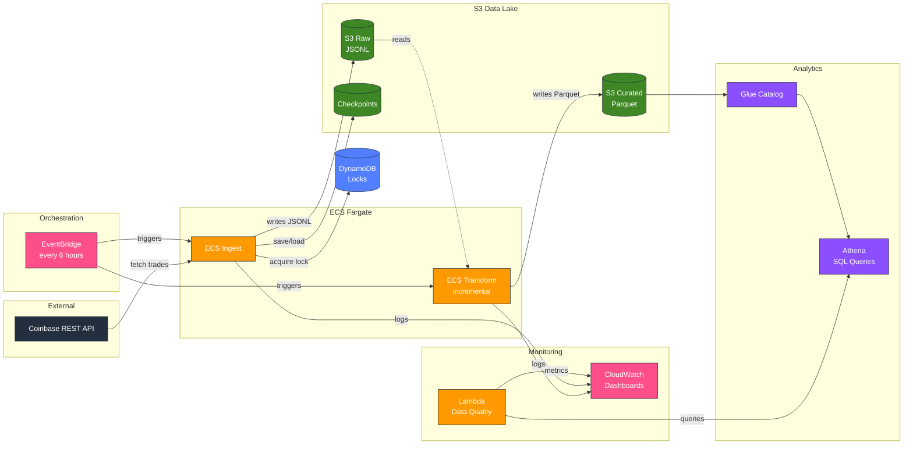
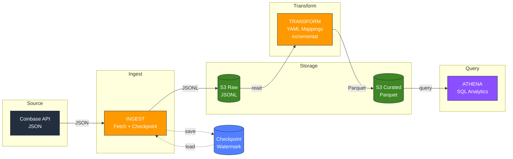
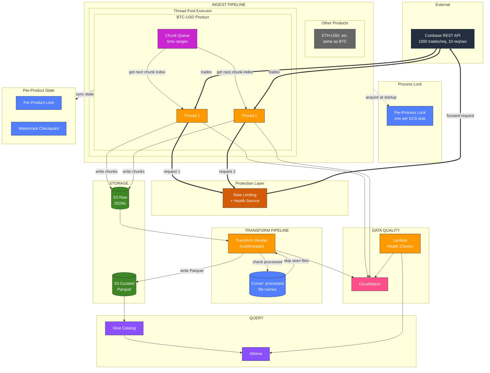
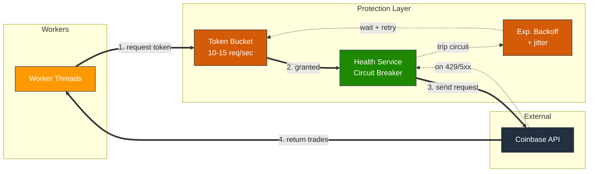
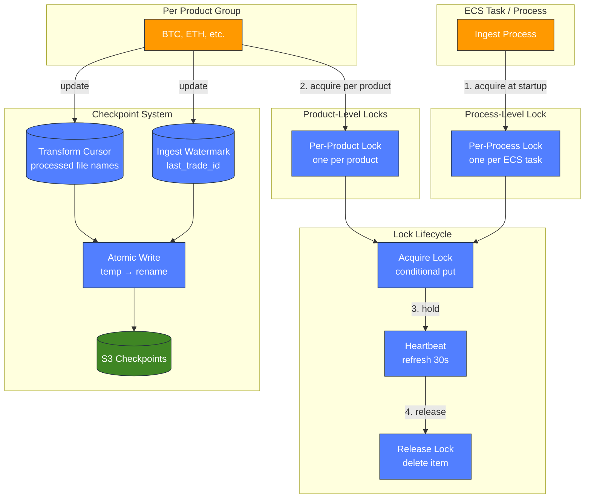

# Architecture Diagrams

## Color Legend

| Color | AWS Service Category |
|-------|---------------------|
|  Orange | Compute (ECS, Lambda) |
|  Green | Storage (S3) |
|  Blue | Database (DynamoDB) |
|  Purple | Analytics (Athena, Glue) |
|  Pink | Management (EventBridge, CloudWatch) |
|  Dark Orange | Rate Limiting |
|  Dark Green | Health Checks |

---

## 1. AWS Architecture

---

## 2. Data Flow (High Level)

---

## 3. Detailed Architecture

---

## 4. Protection Layer Detail

---

## 5. Checkpoint & Locking Detail

---

## Component Legend

| Component | Description |
|-----------|-------------|
| **workers × chunk_concurrency** | Total threads (e.g., 5×9=45) |
| **Little's Law** | C = λ × W → 15 req/s × 3s = 45 threads |
| **Token Bucket** | Rate limit: 10-15 requests/second |
| **Circuit Breaker** | Opens on repeated 429 errors |
| **Watermark** | `last_trade_id` per product for resumable ingestion |
